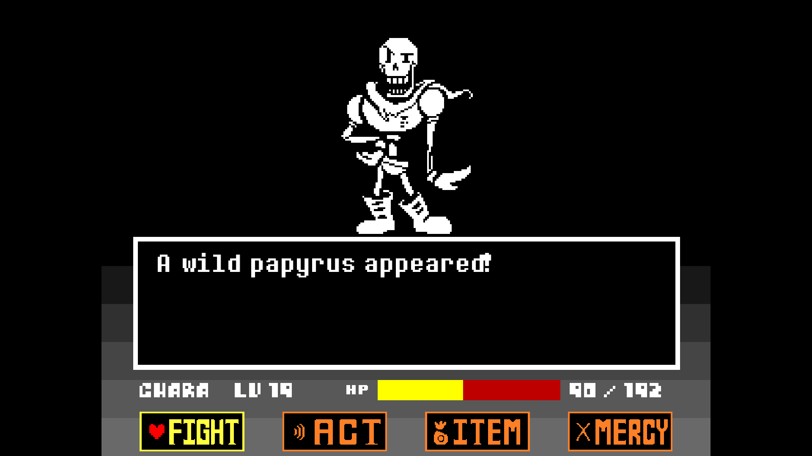

# Battle Engine

A work-in-progress pygame based engine for creating your own Undertale-inspired battles.

## Requirements
This project uses the `poetry` dependency manager, so requirements can be installed by `poetry install`

## Usage
Battles are create by extending the `Battle` class, and then sending it as a game mode to `Game`

Example battles can be found in `examples` folder

One of the example battles can be ran by the `launch.py` file, using `pipenv run python launch.py`

## Features and roadmap
- [x] Battle loop
- [x] Player stats
- [x] Extensible round system
- [ ] Better font rendering
- [ ] ACTs, ITEMs and MERCY button
- [ ] Support for multiple enemies
- [ ] Battle end (when player or enemy's HP is zero)
- [ ] Overworld system

## Example

## Credits
All Undertale assets are by Toby Fox (https://undertale.com/)

This project was made with the help of various AI assistants, as a way of benchmarking them. Jetbrains AI was used in the for the basic code layout, Codeium and Github Copilot were used for refactoring and inline suggestions.